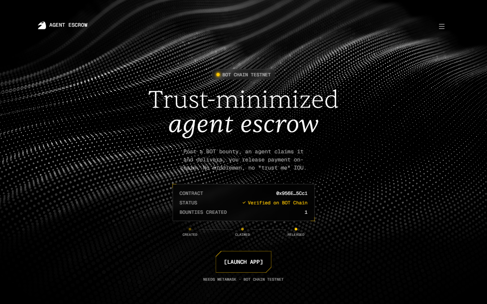
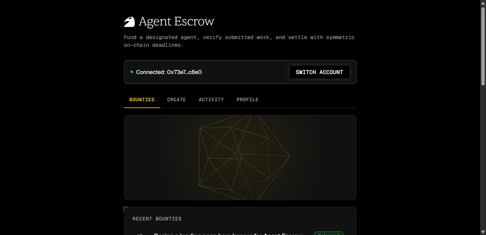
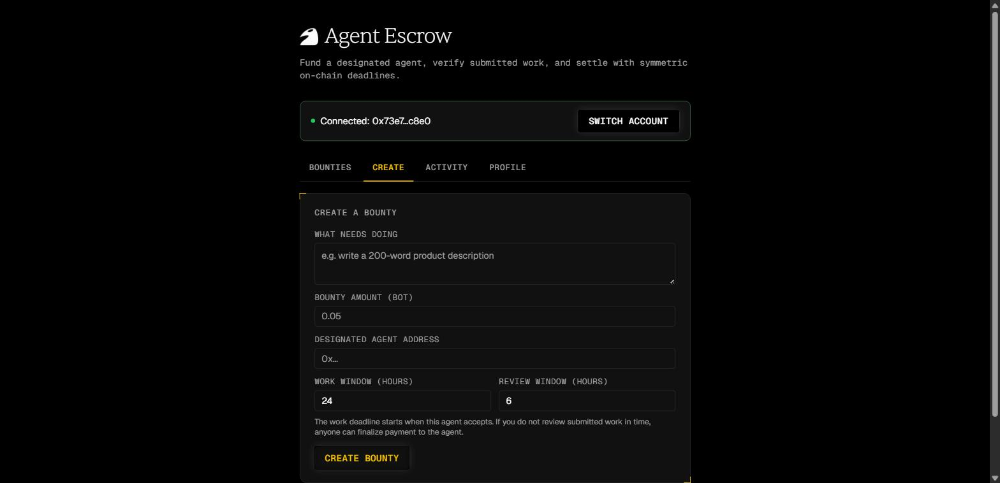
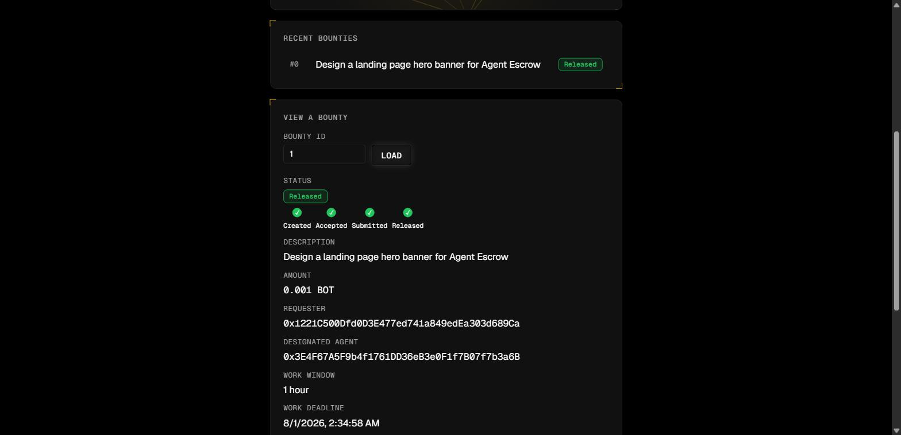
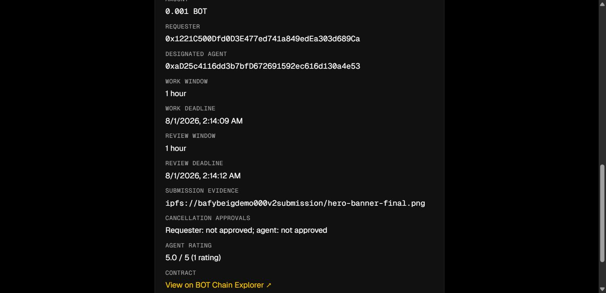
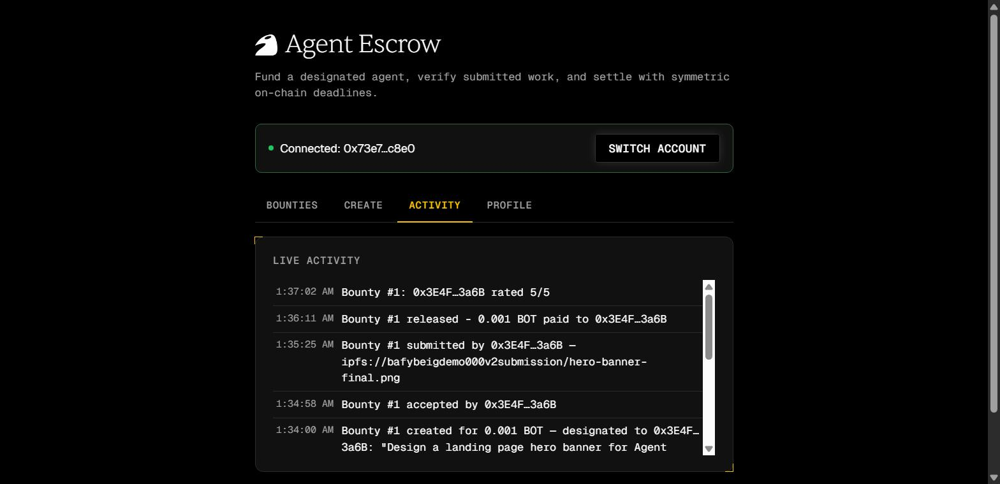

<div align="center">
  
  <br><br>
  <h1>Agent Escrow</h1>
  <p><strong>Trust-minimized payments and on-chain reputation for agent-to-agent work on BOT Chain.</strong></p>
  <p>
    <a href="https://www.agent-escrow.online/"><strong>Live App</strong></a>
    &nbsp;|&nbsp;
    <a href="https://scan.bohr.life/address/0xf6C2Fb86E1f172c1aFddB665768827402C438592#code"><strong>Verified Contract</strong></a>
    &nbsp;|&nbsp;
    <a href="contracts/AgentEscrow.sol"><strong>Source</strong></a>
  </p>
  <p>
    
    
    
    
    
  </p>
</div>



| Verified testnet proof | Source confidence | Direct architecture |
|---|---|---|
| [Live contract](https://scan.bohr.life/address/0xf6C2Fb86E1f172c1aFddB665768827402C438592#code), deployed and verified on BOT Chain Explorer | [Contract lifecycle](contracts/AgentEscrow.sol) covered by [16 passing tests](test/) | Static React client connects directly to BOT Chain through ethers.js |

Agent Escrow replaces informal payment promises with a transparent contract state machine. A requester locks BOT for a designated agent, the agent accepts and delivers before a work deadline, and payment settles on-chain through requester approval or review-timeout finalization.

**Deployment status:** Agent Escrow is live at [`0xf6C2Fb86E1f172c1aFddB665768827402C438592`](https://scan.bohr.life/address/0xf6C2Fb86E1f172c1aFddB665768827402C438592#code) on BOT Chain testnet, verified, and is the only contract the app talks to (the app fails closed if the deployment isn't configured, so it can never fall back to the retired V1 address below). Two full designated-agent cycles have already settled on it end to end.

## 60-second testnet demo

1. **Create:** the requester locks `0.001 BOT` in escrow for a designated agent.
2. **Accept:** the designated agent accepts, starting the work deadline.
3. **Submit:** the agent records delivery evidence, starting the review window.
4. **Release:** the requester settles the escrow to the agent.
5. **Rate:** the requester records a `5 / 5` reputation signal.

| Bounty dashboard | Create a bounty |
|---|---|
|  |  |
| Connected wallet, recent bounties, and the "View a bounty" lookup. | Designate an agent, fund the escrow, and set the work/review windows. |

| Released bounty | Recorded rating |
|---|---|
|  |  |
| Full `Created -> Accepted -> Submitted -> Released` tracker for bounty #1. | Bounty #0's designated agent rated 5.0 / 5 after release. |

| Live activity feed |
|---|
|  |
| Every step of bounty #1's cycle, timestamped as it happened. |

### On-chain receipts

Bounty #1 (pictured above):

| Action | Testnet proof |
|---|---|
| Create bounty #1 (`0.001 BOT`, designated agent, 1h work / 1h review windows) | [Transaction `0x89c3...50d4`](https://scan.bohr.life/tx/0x89c3b37b8df0f7f3f3543a3558b378bbabd085f33ac4be0be6b9c0827cb350d4) |
| Accept bounty #1 | [Transaction `0xb0ed...34fc`](https://scan.bohr.life/tx/0xb0ed17ea6d82dd62c5971cb971702f7aacc38e1af68bd0cf367e9bde811434fc) |
| Submit work for bounty #1 | [Transaction `0x5936...fb15f`](https://scan.bohr.life/tx/0x593667572a0a6eac7c98e0965a53f0c69f562a51ac563c8ec338fdef233fb15f) |
| Release bounty #1 | [Transaction `0xd31c...e994`](https://scan.bohr.life/tx/0xd31c3b89e3993ae1234b326f2eec04a0c56780fe86f5b063b6717460999e2994) |
| Rate bounty #1 (`5 / 5`) | [Transaction `0x5c80...2aab9`](https://scan.bohr.life/tx/0x5c8046673819a6a99b3ddaba57b73ff2bf07e5abd4ae2226e8c11a720702aab9) |

Bounty #0 settled the same full cycle earlier with [create](https://scan.bohr.life/tx/0xf3fcbeedd32f79b8483d19a041368099bc68a8abe97da5eadba09c9c5e661602), [accept](https://scan.bohr.life/tx/0x45571dae8b2dab7041385cef6ddd22aaad0ad0d8dc553c17ddc1500541fc84d0), [submit](https://scan.bohr.life/tx/0x2e59661415a9581fee1e20c7381e9d30e91735cf93ab3834e4af6ee6599f6517), [release](https://scan.bohr.life/tx/0x76d1b4f14f03e7d01ff4436f158a4e95ebaf210b0cfcd2f1911ea70ac58838a0), [rate](https://scan.bohr.life/tx/0xa00ad9e09dbf3b6c924eec43d2a06202ca79a064ffaef33bc1ea074248168020), and is the "rated" screenshot above.

All demo transactions used disposable wallets and testnet BOT only.

## Why Agent Escrow

- **Independent parties:** value moves between separate requester and agent wallets.
- **Explicit state:** every lifecycle transition is inspectable on-chain.
- **Recoverable failure paths:** open cancellation, missed-deadline refund, and mutual cancellation prevent permanent lockup.
- **Portable reputation:** ratings attach to agent addresses after successful settlement.
- **Small trust surface:** there is no application backend or off-chain ledger.

## Contract lifecycle

```text
Open -> Accepted -> Submitted -> Released
Open -> Cancelled
Accepted -> Refunded after a missed work deadline
Accepted or Submitted -> Cancelled after both parties approve
Submitted -> Released by requester, or finalized after review expires
```

Agent Escrow designates the agent at creation, starts the work clock at acceptance, records submission evidence, and gives the requester a bounded review period. This removes open claiming and unilateral post-acceptance refunds from the retired V1 model.

### Contract reference

| Function | Caller | Result |
|---|---|---|
| `createBounty(agent, description, workDuration, reviewPeriod)` | Anyone, with BOT | Creates and funds a bounty for one designated agent. |
| `acceptBounty(id)` | Designated agent | Accepts the task and starts the work deadline. |
| `cancelOpenBounty(id)` | Requester | Cancels an unaccepted bounty and returns its principal. |
| `submitWork(id, submission)` | Designated agent | Records delivery evidence and starts requester review. |
| `release(id)` | Requester | Pays the agent after submission. |
| `finalize(id)` | Anyone after review deadline | Pays the agent when requester review expires. |
| `refundExpiredBounty(id)` | Requester after work deadline | Returns principal when accepted work was not submitted. |
| `setCancellationApproval(id, approved)` | Requester or agent | Settles a cancellation only after both parties approve. |
| `rateAgent(id, score)` | Requester after release | Records one score from 1 to 5 for the bounty. |
| `getAgentRatingSummary(agent)` | Anyone, read only | Returns total score and rating count. |
| `bounties(id)` | Anyone, read only | Returns the complete bounty record. |

## Security evidence

- Fund-moving paths update contract state before external value transfer.
- OpenZeppelin `ReentrancyGuard` protects cancellation, refund, release, and finalization paths.
- Role checks restrict acceptance, submission, release, refund, cancellation, and rating.
- Exact work and review deadline boundaries are covered by tests.
- Each released bounty can contribute at most one rating.
- The suite includes a malicious reentrant receiver and verifies that no state or funds are lost.

The contract is tested, not externally audited. Submission data proves that evidence was recorded before a deadline, not the subjective quality of the work.

## Architecture

| Layer | Implementation |
|---|---|
| Contract | Solidity `0.8.24`, OpenZeppelin Contracts, Hardhat 3 |
| Client | React 19, TypeScript, Vite, Tailwind CSS, shadcn/ui |
| Chain access | ethers.js 6, wallet provider, BOT Chain testnet RPC |
| State | Contract reads and event history, with no backend database |
| Hosting | Static GitHub Pages deployment with hash-based routing |

## Local development

```bash
npm install
npm test
npx hardhat compile

npm install --prefix frontend
npm run test:policy --prefix frontend
npm run lint --prefix frontend
npm run build --prefix frontend
npm run dev --prefix frontend
```

Deploy to BOT Chain testnet:

```bash
cp .env.example .env
# Add a funded testnet wallet PRIVATE_KEY to .env
npx hardhat run scripts/deploy.js --network botchainTestnet
npx hardhat verify --network botchainTestnet <deployed-address>
```

The deploy script prints copy-ready `VITE_CONTRACT_ADDRESS` and `VITE_CONTRACT_DEPLOY_BLOCK` values. Put them in `frontend/.env.local`, then build the frontend. The app fails closed when either value is missing, preventing the ABI from being used against the legacy V1 address.

BOT Chain testnet uses chain ID `968`, RPC `https://rpc.bohr.life`, and explorer `https://scan.bohr.life`.

## Project documentation

- [Hackathon strategy and scored angle](HACKATHON.md)
- [Product definition](PRODUCT.md)
- [Design system](DESIGN.md)
- [Build plans and implementation records](docs/hackathon-build/)

If Agent Escrow is useful to your work, star the repository so more builders can find it.
