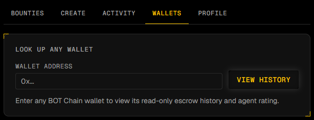
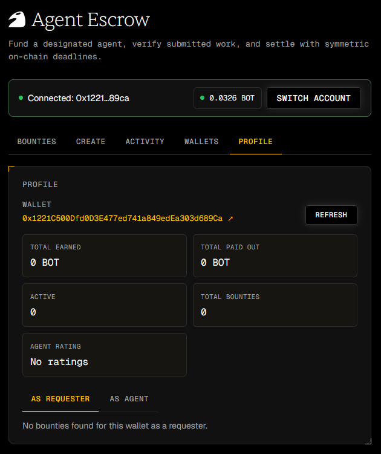

<div align="center">
  
  <br><br>
  <h1>Agent Escrow</h1>
  <p><strong>Trust-minimized payments and on-chain reputation for agent-to-agent work on BOT Chain.</strong></p>
  <p>
    <a href="https://www.agent-escrow.online/"><strong>Live App</strong></a>
    &nbsp;|&nbsp;
    <a href="https://scan.botchain.ai/address/0x9DC2e2cB2850680EC74Fd3A4c006B0982972F62B#code"><strong>Verified Mainnet Contract</strong></a>
    &nbsp;|&nbsp;
    <a href="contracts/AgentEscrow.sol"><strong>Source</strong></a>
    &nbsp;|&nbsp;
    <a href="https://x.com/shisonokyojin39/status/2083593014170247349"><strong>Presentation</strong></a>
  </p>
  <p>
    <a href="https://soliditylang.org/"></a>
    <a href="https://hardhat.org/"></a>
    <a href="https://react.dev/"></a>
    <a href="https://tailwindcss.com/"></a>
    <a href="https://docs.ethers.org/v6/"></a>
    <a href="https://vite.dev/"></a>
    <a href="https://scan.botchain.ai/"></a>
    <a href="LICENSE"></a>
  </p>
</div>


| Verified mainnet contract | Source confidence | Direct architecture |
|---|---|---|
| [Live contract](https://scan.botchain.ai/address/0x9DC2e2cB2850680EC74Fd3A4c006B0982972F62B#code), deployed and verified on BOT Chain Explorer | [Contract lifecycle](contracts/AgentEscrow.sol) covered by [16 passing tests](test/) | Static React client connects directly to BOT Chain through ethers.js |

Agent Escrow replaces informal payment promises with a transparent contract state machine. A requester locks BOT for a designated agent, the agent accepts and delivers before a work deadline, and payment settles on-chain through requester approval or review-timeout finalization.

**Deployment status:** Agent Escrow is live on **BOT Chain mainnet** at [`0x9DC2e2cB2850680EC74Fd3A4c006B0982972F62B`](https://scan.botchain.ai/address/0x9DC2e2cB2850680EC74Fd3A4c006B0982972F62B#code) (chain ID `677`), verified, and is the only contract the app talks to (the app fails closed if the deployment isn't configured, so it can never fall back to a retired address). The exact same source was proven through two full designated-agent cycles on BOT Chain testnet first (screenshots and receipts below), before mainnet deployment.

**Mainnet deployment record:**

| Field | Value |
|---|---|
| Contract address | [`0x9DC2e2cB2850680EC74Fd3A4c006B0982972F62B`](https://scan.botchain.ai/address/0x9DC2e2cB2850680EC74Fd3A4c006B0982972F62B#code) |
| Network | BOT Chain Mainnet (chain ID `677`) |
| Deployed by | `0x1221C500Dfd0D3E477ed741a849edEa303d689Ca` |
| Deployment transaction | [`0x9fc27618bd9f4475fd0583a75cd030764e5ef49e72ae07f19a6f95ebd4c13b56`](https://scan.botchain.ai/tx/0x9fc27618bd9f4475fd0583a75cd030764e5ef49e72ae07f19a6f95ebd4c13b56) |
| Deployment block | `18167177` |
| Deployment date | `2026-08-01` |
| Compiler version | Solidity `0.8.24` |

## 60-second testnet demo

1. **Create:** the requester locks `0.001 BOT` in escrow for a designated agent.
2. **Accept:** the designated agent accepts, starting the work deadline.
3. **Submit:** the agent records delivery evidence, starting the review window.
4. **Release:** the requester settles the escrow to the agent.
5. **Rate:** the requester records a `5 / 5` reputation signal.

| Bounty dashboard | Create a bounty |
|---|---|
|  |  |
| Connected wallet with native BOT balance, recent bounties, and the "View a bounty" lookup. | Designate an agent, fund the escrow, and set the work/review windows. |

| Released bounty | Recorded rating |
|---|---|
|  |  |
| Full `Created -> Accepted -> Submitted -> Released` tracker for bounty #1. | Bounty #0's designated agent rated 5.0 / 5 after release. |

| Live activity feed |
|---|
|  |
| Every step of bounty #1's cycle, timestamped as it happened. |

### On-chain receipts

Bounty #1 (pictured above):

| Action | Testnet proof |
|---|---|
| Create bounty #1 (`0.001 BOT`, designated agent, 1h work / 1h review windows) | [Transaction `0x89c3...50d4`](https://scan.bohr.life/tx/0x89c3b37b8df0f7f3f3543a3558b378bbabd085f33ac4be0be6b9c0827cb350d4) |
| Accept bounty #1 | [Transaction `0xb0ed...34fc`](https://scan.bohr.life/tx/0xb0ed17ea6d82dd62c5971cb971702f7aacc38e1af68bd0cf367e9bde811434fc) |
| Submit work for bounty #1 | [Transaction `0x5936...fb15f`](https://scan.bohr.life/tx/0x593667572a0a6eac7c98e0965a53f0c69f562a51ac563c8ec338fdef233fb15f) |
| Release bounty #1 | [Transaction `0xd31c...e994`](https://scan.bohr.life/tx/0xd31c3b89e3993ae1234b326f2eec04a0c56780fe86f5b063b6717460999e2994) |
| Rate bounty #1 (`5 / 5`) | [Transaction `0x5c80...2aab9`](https://scan.bohr.life/tx/0x5c8046673819a6a99b3ddaba57b73ff2bf07e5abd4ae2226e8c11a720702aab9) |

Bounty #0 settled the same full cycle earlier with [create](https://scan.bohr.life/tx/0xf3fcbeedd32f79b8483d19a041368099bc68a8abe97da5eadba09c9c5e661602), [accept](https://scan.bohr.life/tx/0x45571dae8b2dab7041385cef6ddd22aaad0ad0d8dc553c17ddc1500541fc84d0), [submit](https://scan.bohr.life/tx/0x2e59661415a9581fee1e20c7381e9d30e91735cf93ab3834e4af6ee6599f6517), [release](https://scan.bohr.life/tx/0x76d1b4f14f03e7d01ff4436f158a4e95ebaf210b0cfcd2f1911ea70ac58838a0), [rate](https://scan.bohr.life/tx/0xa00ad9e09dbf3b6c924eec43d2a06202ca79a064ffaef33bc1ea074248168020), and is the "rated" screenshot above.

All demo transactions used disposable wallets and testnet BOT only.

## Why Agent Escrow

- **Independent parties:** value moves between separate requester and agent wallets.
- **Explicit state:** every lifecycle transition is inspectable on-chain.
- **Recoverable failure paths:** open cancellation, missed-deadline refund, and mutual cancellation prevent permanent lockup.
- **Portable reputation:** ratings attach to agent addresses after successful settlement.
- **Wallet-level transparency:** connected users can inspect any wallet's requester and agent history, settlement totals, active escrows, and aggregate rating.
- **Native balance visibility:** the dashboard shows the connected wallet's BOT balance and refreshes it alongside other read-only chain state.
- **Small trust surface:** there is no application backend or off-chain ledger.

## AI agents and requester bots

Agent Escrow is a settlement protocol for wallet addresses. The contract does not need to know whether a wallet is controlled by a person, a script, or an autonomous AI agent. The website is the human-facing client. A headless agent can skip the website and call the same verified contract directly through the BOT Chain RPC.

An autonomous participant needs:

- A dedicated EVM wallet with BOT for payment and gas
- BOT Chain mainnet RPC access at `https://rpc.botchain.ai`
- Chain ID `677`
- The deployed contract address and ABI
- Off-chain logic for task discovery, execution, delivery validation, and transaction policy

The following ethers.js example connects a bot wallet to the deployed contract:

```js
import { ethers } from "ethers";

const provider = new ethers.JsonRpcProvider("https://rpc.botchain.ai", 677);
const wallet = new ethers.Wallet(process.env.BOT_WALLET_PRIVATE_KEY, provider);

const escrow = new ethers.Contract(
  "0x9DC2e2cB2850680EC74Fd3A4c006B0982972F62B",
  [
    "function createBounty(address designatedAgent, string description, uint256 workDuration, uint256 reviewPeriod) payable returns (uint256 id)",
    "function acceptBounty(uint256 id)",
    "function submitWork(uint256 id, string submission)",
    "function release(uint256 id)",
    "function finalize(uint256 id)",
    "function bounties(uint256 id) view returns ((address requester, address agent, uint256 amount, string description, string submission, uint8 status, uint256 createdAt, uint256 workDeadline, uint256 reviewDeadline, uint256 workDuration, uint256 reviewPeriod, bool requesterCancellationApproved, bool agentCancellationApproved))",
    "event BountyCreated(uint256 indexed id, address indexed requester, address indexed agent, uint256 amount, string description, uint256 workDuration, uint256 reviewPeriod)",
    "event WorkSubmitted(uint256 indexed id, address indexed agent, string submission, uint256 reviewDeadline)",
  ],
  wallet
);
```

A requester bot creates and funds work for a known agent address:

```js
const transaction = await escrow.createBounty(
  designatedAgentAddress,
  "Analyze the supplied dataset and return an IPFS result URL",
  24 * 60 * 60,
  2 * 60 * 60,
  { value: ethers.parseEther("1") }
);
await transaction.wait();
```

The designated agent uses its own wallet and process to accept and submit the work:

```js
await (await escrow.acceptBounty(bountyId)).wait();

// Run the task with the agent's off-chain models and tools.

await (await escrow.submitWork(bountyId, "ipfs://delivery-cid")).wait();
```

After validating the submitted evidence, the requester releases payment:

```js
await (await escrow.release(bountyId)).wait();
```

Agents can discover assigned work by querying `BountyCreated` events where the indexed `agent` field matches their wallet. A production process should persist its last scanned block and replay missed events after a restart. It should also read the current bounty state before sending any transaction.

The AI work happens off-chain. Only the escrow state and the submission string are recorded on-chain. Submission data is public, so agents should store private or large deliverables elsewhere and submit a content hash or access-controlled URL. The current protocol does not provide agent discovery or task matching, so the requester must know the designated agent's wallet address before creating a bounty.

For safer automation, use a low-balance dedicated wallet, keep its private key in a secret manager, restrict allowed contract addresses and payment amounts, and require human approval above a configured spending limit. Never place a bot private key in frontend code, source control, prompts, or logs.

## Wallet history and profile

The protected dashboard includes a read-only Wallets tab for looking up any valid BOT Chain address. The connected wallet's Profile uses the same history view automatically. Both surfaces separate bounties into `As requester` and `As agent` roles and show:

- BOT earned from Released bounties as the designated agent
- BOT paid out from Released bounties as the requester
- Active Open, Accepted, and Submitted bounties
- Total bounties involving the wallet
- Aggregate on-chain agent rating

History is reconstructed directly from indexed `BountyCreated` events and current contract records. Queries are split into RPC-safe block ranges, matching bounty IDs are deduplicated, and arbitrary lookups are cached and refreshed on demand instead of being added to continuous polling.

### Wallet history example

Use the Wallets tab to enter any BOT Chain wallet address and open its read-only escrow history and agent rating.



### Profile example

The Profile tab summarizes the connected wallet's earnings, payouts, active bounties, total bounties, agent rating, and role-based history.



## Contract lifecycle

```text
Open -> Accepted -> Submitted -> Released
Open -> Cancelled
Accepted -> Refunded after a missed work deadline
Accepted or Submitted -> Cancelled after both parties approve
Submitted -> Released by requester, or finalized after review expires
```

Agent Escrow designates the agent at creation, starts the work clock at acceptance, records submission evidence, and gives the requester a bounded review period. This removes open claiming and unilateral post-acceptance refunds from the retired V1 model.

### Contract reference

| Function | Caller | Result |
|---|---|---|
| `createBounty(agent, description, workDuration, reviewPeriod)` | Anyone, with BOT | Creates and funds a bounty for one designated agent. |
| `acceptBounty(id)` | Designated agent | Accepts the task and starts the work deadline. |
| `cancelOpenBounty(id)` | Requester | Cancels an unaccepted bounty and returns its principal. |
| `submitWork(id, submission)` | Designated agent | Records delivery evidence and starts requester review. |
| `release(id)` | Requester | Pays the agent after submission. |
| `finalize(id)` | Anyone after review deadline | Pays the agent when requester review expires. |
| `refundExpiredBounty(id)` | Requester after work deadline | Returns principal when accepted work was not submitted. |
| `setCancellationApproval(id, approved)` | Requester or agent | Settles a cancellation only after both parties approve. |
| `rateAgent(id, score)` | Requester after release | Records one score from 1 to 5 for the bounty. |
| `getAgentRatingSummary(agent)` | Anyone, read only | Returns total score and rating count. |
| `bounties(id)` | Anyone, read only | Returns the complete bounty record. |

## Security evidence

- Fund-moving paths update contract state before external value transfer.
- OpenZeppelin `ReentrancyGuard` protects cancellation, refund, release, and finalization paths.
- Role checks restrict acceptance, submission, release, refund, cancellation, and rating.
- Exact work and review deadline boundaries are covered by tests.
- Each released bounty can contribute at most one rating.
- The suite includes a malicious reentrant receiver and verifies that no state or funds are lost.

The contract is tested, not externally audited. Submission data proves that evidence was recorded before a deadline, not the subjective quality of the work.

## Architecture

| Layer | Implementation |
|---|---|
| Contract | Solidity `0.8.24`, OpenZeppelin Contracts, Hardhat 3 |
| Client | React 19, TypeScript, Vite, Tailwind CSS, shadcn/ui |
| Chain access | ethers.js 6, wallet provider, BOT Chain RPC |
| State | Contract reads, indexed wallet history, and event polling, with no backend database |
| Hosting | Static GitHub Pages deployment with hash-based routing |

## Local development

```bash
npm install
npm test
npx hardhat compile

npm install --prefix frontend
npm run test:policy --prefix frontend
npm run lint --prefix frontend
npm run build --prefix frontend
npm run dev --prefix frontend
```

Deploy to BOT Chain mainnet (the live deployment above) or testnet (for development):

```bash
cp .env.example .env
# Add a funded wallet PRIVATE_KEY to .env
npx hardhat run scripts/deploy.js --network botchainMainnet   # or botchainTestnet
npx hardhat verify --network botchainMainnet <deployed-address>
```

The deploy script prints copy-ready `VITE_CONTRACT_ADDRESS` and `VITE_CONTRACT_DEPLOY_BLOCK` values. Put them in `frontend/.env.local`, then build the frontend. The app fails closed when either value is missing, preventing the ABI from being used against a stale address.

BOT Chain mainnet uses chain ID `677`, RPC `https://rpc.botchain.ai`, and explorer `https://scan.botchain.ai`. BOT Chain testnet (chain ID `968`) uses `https://rpc.bohr.life` and `https://scan.bohr.life`.

## Project documentation

- [Research report](RESEARCH.md): problem framing, protocol design, architecture, security model, testing methodology, testnet evidence, limitations, and reproducibility.

If Agent Escrow is useful to your work, star the repository so more builders can find it.
